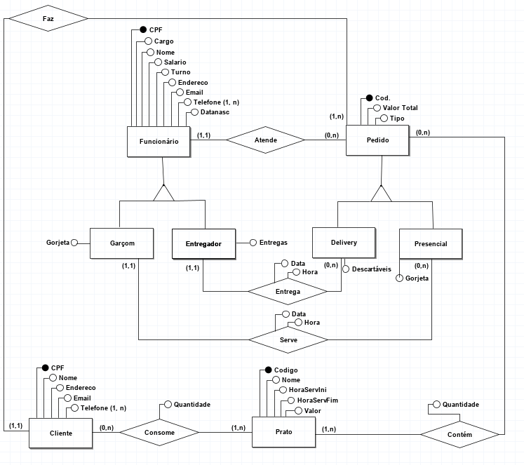

## Restaurante - Banco de Dados SQL

O projeto foi realizado durante a disciplina de Banco de Dados no curso de Engenharia de Computação.

### Ideia

Desenvolver o sistema de inserção e filtragem de dados com SQL.

### Modelo Entidade Relacionamento

No modelo entidade relacionamento foi feita a construção das entidades, dos relacionamentos, dos intervalos máximos e mínimos e a classificação dos relacionamentos. 

### Modelo Relacional

Modelo em que representamos o MER em forma de relaçoes e atributos para implementação posterior.

### Implementação

Foi utilizado o [PHP MyAdmin](https://www.phpmyadmin.net/) para implementação dos códigos em SQL. Foram realizadas inserções, consultas e outras funções.

###### Créditos: [brModelo](http://www.sis4.com/brModelo/)
